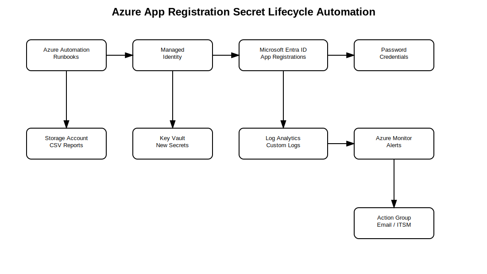
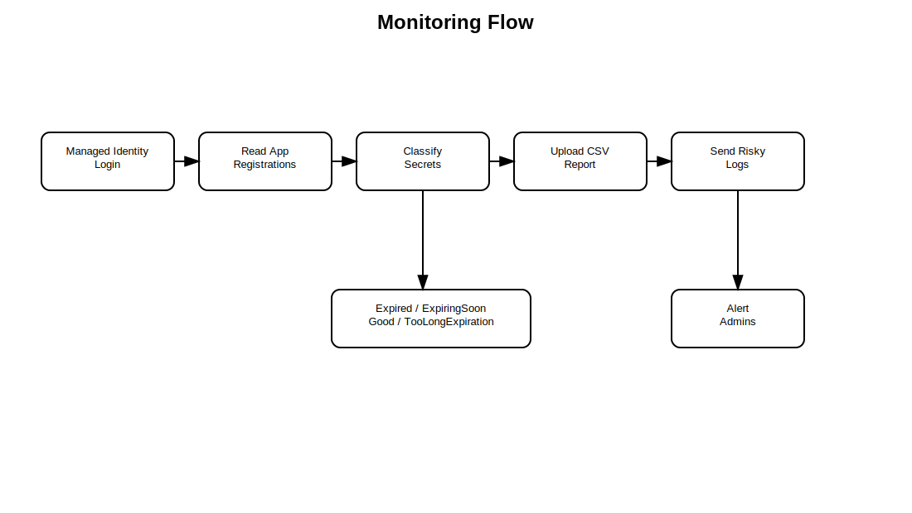
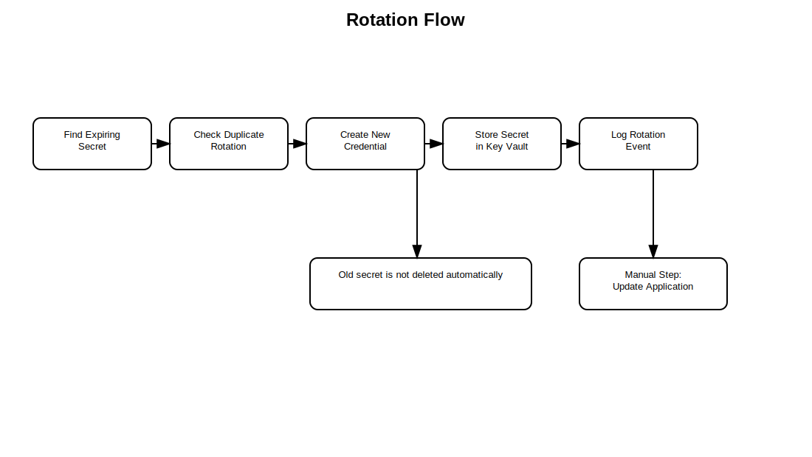

# Azure App Registration Secret Lifecycle Automation


Azure App Registration Secret Lifecycle Automation is a PowerShell-based Azure security operations lab for monitoring Microsoft Entra ID App Registration secrets, reporting expiration status, logging risky secrets to Log Analytics, uploading CSV reports to Blob Storage, and optionally creating replacement secrets before expiration.

> This is a lab / proof-of-concept project. Test in a non-production tenant first. Rotating an App Registration secret can break applications if the consuming workload is not updated to use the new secret.

## Why This Project Exists

Many Azure environments have App Registrations with client secrets that expire silently or remain valid for too long. This can cause outages, weak governance, and manual tracking problems.

This project demonstrates a practical automation pattern:

- scan App Registration client secrets
- classify each secret as expired, expiring soon, healthy, or too long-lived
- send risky findings to Log Analytics
- upload a full CSV report to Blob Storage
- alert administrators through Azure Monitor
- optionally create a replacement secret and store it in Key Vault

## Important Safety Clarification

This solution can create a new App Registration secret and store it in Key Vault.

It does **not** automatically update the application, pipeline, workload, or external system that currently uses the old secret.

A safe production rotation process usually requires:

1. Create the new secret.
2. Store it securely in Key Vault.
3. Update the consuming application or pipeline to read the new secret.
4. Validate the consuming application works.
5. Only then remove the old secret.

This project intentionally does not delete old credentials automatically.

## Architecture



Main components:

- Azure Automation Account
- System-assigned managed identity
- Microsoft Entra ID App Registrations
- Azure Key Vault
- Log Analytics Workspace
- Azure Monitor scheduled query alerts
- Storage Account / Blob container for CSV reports
- Optional Action Group notification

## Monitoring Flow



The monitoring runbook:

1. Authenticates using Azure Automation managed identity.
2. Reads configuration values from environment variables / Automation variables.
3. Scans App Registration password credentials.
4. Classifies each credential by expiration status.
5. Writes a full CSV report to Blob Storage.
6. Sends only risky records to Log Analytics.

Statuses:

| Status | Meaning |
|---|---|
| `Expired` | Secret is already expired |
| `ExpiringSoon` | Secret expires within the configured threshold |
| `Good` | Secret is valid and within the allowed maximum lifetime |
| `TooLongExpiration` | Secret is valid for longer than the configured maximum lifetime |

## Rotation Flow



The rotation runbook:

1. Scans App Registration password credentials.
2. Finds secrets expiring within the rotation threshold.
3. Skips apps already rotated recently.
4. Creates a new App Registration password credential.
5. Stores the new secret value in Key Vault.
6. Logs the rotation event to Log Analytics.
7. Leaves the old credential in place for application migration.

## Current Status

| Area | Status |
|---|---|
| Secret expiration scan | Implemented |
| CSV report generation | Implemented |
| Blob report upload | Implemented |
| Log Analytics custom log ingestion | Implemented |
| Azure Monitor alert queries | Documented in deployment scripts |
| Secret rotation | Implemented with duplicate-rotation guard |
| Key Vault storage for new secret | Implemented |
| Old secret deletion | Not included by design |
| Application-side secret update | Not included |
| Production approval workflow | Not included |

## Repository Structure

```text
azure-appreg-secrets-ops/
  README.md
  LICENSE
  .gitignore
  deploy/
    deploy.ps1
    deploy.sh
  scripts/
    monitor-secrets.ps1
    rotate-secrets.ps1
  docs/
    images/
      architecture-appreg-secret-ops.svg
      monitoring-flow.svg
      rotation-flow.svg
    sample-output/
      app-secret-report.csv
      log-analytics-record.json
      rotation-result.json
```

## Prerequisites

- Azure subscription
- Permissions to create Azure resources
- Permissions to read App Registrations
- Permissions to create App Registration password credentials, if using rotation
- Azure PowerShell or Azure CLI
- Non-production tenant for first test

Recommended PowerShell modules for Automation Account runbooks:

```text
Az.Accounts
Az.Resources
Az.KeyVault
Az.Storage
```

## Deployment

PowerShell:

```powershell
.\deploy\deploy.ps1 `
  -SubscriptionId "<subscription-id>" `
  -ProjectPrefix "appregops" `
  -Location "eastus" `
  -NotificationEmail "admin@example.com"
```

Bash:

```bash
./deploy/deploy.sh "<subscription-id>" appregops eastus admin@example.com
```

## What Deployment Creates

- Resource Group
- Storage Account
- Blob container for reports
- Key Vault
- Log Analytics Workspace
- Azure Automation Account
- System-assigned managed identity
- Basic RBAC assignments
- Action Group
- Scheduled query alert for expiring secrets

The deployment scripts do not fully configure Microsoft Graph / Entra permissions for every tenant scenario. Verify that the Automation Account managed identity has the permissions needed to read applications and create credentials.

## Required Configuration After Deployment

The runbooks expect these values as Automation variables or environment variables:

| Name | Purpose |
|---|---|
| `APPREGOPS_KEYVAULT_NAME` | Key Vault name used to store rotated secrets |
| `APPREGOPS_STORAGE_ACCOUNT_NAME` | Storage account for CSV reports |
| `APPREGOPS_STORAGE_CONTAINER_NAME` | Blob container for CSV reports |
| `APPREGOPS_WORKSPACE_ID` | Log Analytics Workspace customer ID |
| `APPREGOPS_WORKSPACE_KEY` | Log Analytics shared key |
| `APPREGOPS_SECRET_NAME_PREFIX` | Optional Key Vault secret prefix |

## Monitor Secrets

```powershell
.\scripts\monitor-secrets.ps1 -ExpiringInDays 15 -TooLongThreshold 180
```

The monitoring script creates a CSV report with columns:

```text
TimeGenerated,AppName,AppId,SecretId,ExpirationDate,DaysRemaining,Status
```

## Rotate Secrets

```powershell
.\scripts\rotate-secrets.ps1 -ExpiringInDays 30 -ExpirationDays 180
```

Safer dry-run:

```powershell
.\scripts\rotate-secrets.ps1 -ExpiringInDays 30 -ExpirationDays 180 -WhatIfOnly
```

Rotation behavior:

- Creates a new password credential for App Registrations with secrets expiring within threshold.
- Stores the new secret value in Key Vault.
- Logs the event to Log Analytics.
- Does not remove the old credential.
- Does not update application configuration.

## Log Analytics Tables

| Log Type | Table |
|---|---|
| `AppSecretExpiry` | `AppSecretExpiry_CL` |
| `AppSecretRotation` | `AppSecretRotation_CL` |

Example KQL:

```kusto
AppSecretExpiry_CL
| where Status_s in ("Expired", "ExpiringSoon")
| summarize LatestTime = arg_max(TimeGenerated, *) by AppId_s, SecretId_g
| order by DaysRemaining_d asc
```

## Security Notes

- Test in a non-production tenant first.
- Do not delete old credentials automatically.
- Do not rotate production secrets unless the consuming application migration is planned.
- Prefer federated credentials or certificate-based credentials where possible.
- Use least-privilege RBAC and Microsoft Graph permissions.
- Restrict Key Vault access.
- Protect Log Analytics workspace keys.
- Review every role assignment created by deployment scripts.

## Cleanup

```powershell
Remove-AzResourceGroup -Name "appregops-rg" -Force
```

or:

```bash
az group delete --name appregops-rg --yes
```

Before cleanup, confirm the resource group contains only lab resources.

## Suggested GitHub Repository Metadata

Description:

```text
Azure automation lab for monitoring and rotating Microsoft Entra ID App Registration secrets with Key Vault, Log Analytics, and CSV reporting.
```

Topics:

```text
azure entra-id app-registration key-vault log-analytics azure-automation powershell security secret-rotation cloud-security identity devops
```

## License

MIT License. See [LICENSE](./LICENSE) for details.
